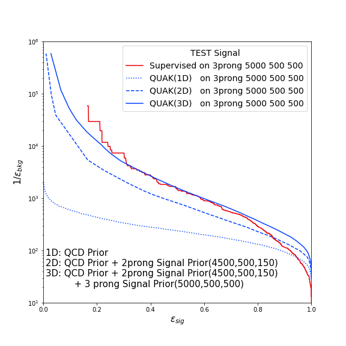
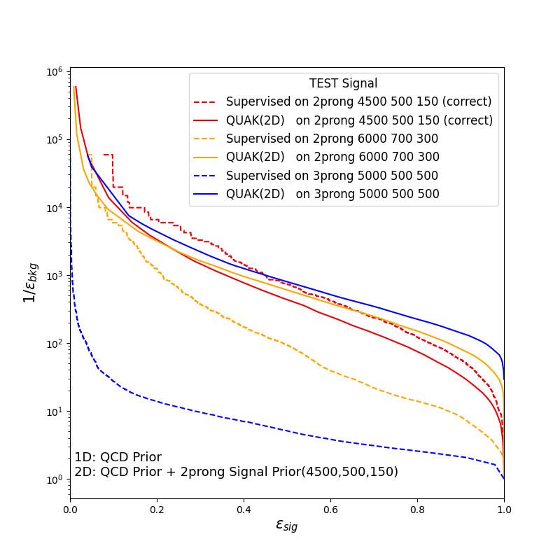

# QUAK
QUasi Anomalous Knowledge for Anomaly Detection and Tagging in High Energy Physics

<p align="left">

</p>

# Quasi Anomalous Knowledge: Searching for new physics with embedded knowledge

This repository is the official implementation of [Quasi Anomalous Knowledge: Searching for new physics with embedded knowledge](https://arxiv.org/abs/2011.03550). 

<p float="left">
  
   
</p>


## Requirements

I used conda to manage my dependencies.

To install requirements:

```setup
conda env create -f environment.yml
```

## Training

To train the model(s) in the paper, run this command:

```train
python train_script.py
```

## Evaluation

To evaluate QUAK performance on LHCO dataset, run:

```eval
python eval.py --model-file mymodel.pth --benchmark imagenet
```

To evaluate QUAK performance on MNIST dataset, run:

## Citation

We are preparing a journal submission, in the meantime, please cite our paper from arxiv:

@article{Park:2020pak,
    author = "Park, Sang Eon and Rankin, Dylan and Udrescu, Silviu-Marian and Yunus, Mikaeel and Harris, Philip",
    title = "{Quasi Anomalous Knowledge: Searching for new physics with embedded knowledge}",
    eprint = "2011.03550",
    archivePrefix = "arXiv",
    primaryClass = "hep-ph",
    month = "11",
    year = "2020"
}


## Pre-trained Models

You can download pretrained models here:

- [My awesome model](https://drive.google.com/mymodel.pth) trained on ImageNet using parameters x,y,z. 


## Results

Our model achieves the following performance on :

### [Image Classification on ImageNet](https://paperswithcode.com/sota/image-classification-on-imagenet)

| Model name         | Top 1 Accuracy  | Top 5 Accuracy |
| ------------------ |---------------- | -------------- |
| My awesome model   |     85%         |      95%       |


## Contributing
